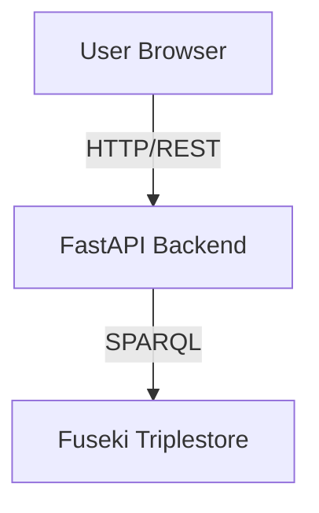

# Visual Diagrams for Confluence

These diagrams can be added to Confluence pages using the "Draw.io" or "Gliffy" macros.

---

## System Architecture Diagram

```
┌─────────────────────────────────────────────────────────────┐
│                        User Browser                         │
│  ┌───────────────────────────────────────────────────────┐  │
│  │           React Frontend (TypeScript)                 │  │
│  │                                                        │  │
│  │  ┌──────────────┐      ┌──────────────┐             │  │
│  │  │IEDExplorer   │      │Dashboard     │             │  │
│  │  │Page          │      │Page          │             │  │
│  │  │              │      │              │             │  │
│  │  │┌────────────┐│      │┌────────────┐│             │  │
│  │  ││IEDMaster   ││      ││SCL Files   ││             │  │
│  │  ││Panel       ││      ││List        ││             │  │
│  │  │└────────────┘│      │└────────────┘│             │  │
│  │  │              │      │              │             │  │
│  │  │┌────────────┐│      │              │             │  │
│  │  ││IEDDetail   ││      │              │             │  │
│  │  ││Panel       ││      │              │             │  │
│  │  ││            ││      │              │             │  │
│  │  ││┌──────────┐││      │              │             │  │
│  │  │││Expandable│││      │              │             │  │
│  │  │││Tree      │││      │              │             │  │
│  │  ││└──────────┘││      │              │             │  │
│  │  │└────────────┘│      │              │             │  │
│  │  └──────────────┘      └──────────────┘             │  │
│  └───────────────────────────────────────────────────────┘  │
└─────────────────────────────────────────────────────────────┘
                            │
                            │ HTTP/REST (JSON)
                            │ JWT Authentication
                            ↓
┌─────────────────────────────────────────────────────────────┐
│                    FastAPI Backend (Python)                 │
│  ┌───────────────────────────────────────────────────────┐  │
│  │                   API Endpoints                       │  │
│  │                                                        │  │
│  │  /api/ieds           Get IED list (grouped/filtered) │  │
│  │  /api/ieds/tree      Get children of specific node   │  │
│  │  /api/scl-files      SCL file management             │  │
│  │  /api/auth           Authentication                   │  │
│  └───────────────────────────────────────────────────────┘  │
│                            │                                │
│                            │ SPARQL Queries                 │
│                            ↓                                │
│  ┌───────────────────────────────────────────────────────┐  │
│  │                    RDF Client                         │  │
│  │  - Query builder                                      │  │
│  │  - Result parser                                      │  │
│  │  - Error handling                                     │  │
│  └───────────────────────────────────────────────────────┘  │
└─────────────────────────────────────────────────────────────┘
                            │
                            │ HTTP (SPARQL Protocol)
                            ↓
┌─────────────────────────────────────────────────────────────┐
│              Apache Jena Fuseki (RDF Triplestore)           │
│  ┌───────────────────────────────────────────────────────┐  │
│  │  Dataset: SCD_POSTE_V1                                │  │
│  │  - 5.7M triples                                       │  │
│  │  - IED hierarchy data                                 │  │
│  │  - SPARQL endpoint                                    │  │
│  └───────────────────────────────────────────────────────┘  │
└─────────────────────────────────────────────────────────────┘
```

---

## Component Hierarchy Diagram

```
IEDExplorerPage
├── Props: none (gets file_id from URL)
├── State:
│   ├── groupBy: 'type' | 'bay'
│   ├── searchQuery: string
│   └── selectedIED: IED | null
│
├── IEDMasterPanel
│   ├── Props:
│   │   ├── fileId: number
│   │   ├── groupBy: 'type' | 'bay'
│   │   ├── searchQuery: string
│   │   ├── selectedIED: string | null
│   │   └── onSelectIED: (ied: IED) => void
│   │
│   ├── State:
│   │   ├── groups: { [key: string]: IED[] }
│   │   ├── loading: boolean
│   │   └── error: string | null
│   │
│   └── API: GET /api/ieds
│
└── IEDDetailPanel
    ├── Props:
    │   ├── fileId: number
    │   └── selectedIED: IED | null
    │
    ├── State:
    │   ├── treeRoot: TreeNode | null
    │   ├── loading: boolean
    │   └── error: string | null
    │
    ├── API: GET /api/ieds/tree
    │
    └── ExpandableTree (Recursive)
        ├── Props:
        │   ├── rootNode: TreeNode | null
        │   ├── onExpand: (node: TreeNode) => void
        │   └── loading?: boolean
        │
        └── Renders recursively for each child node
```

---

## Data Flow Diagram

```
┌──────────────────────────────────────────────────────────────────┐
│ 1. Initial Load                                                  │
└──────────────────────────────────────────────────────────────────┘

User navigates to /ied-explorer?file_id=1
         │
         ↓
IEDExplorerPage mounts
         │
         ├─→ IEDMasterPanel mounts
         │         │
         │         ↓
         │   useEffect triggers (fileId, groupBy, searchQuery changed)
         │         │
         │         ↓
         │   fetchIEDs() called
         │         │
         │         ↓
         │   GET /api/ieds?file_id=1&group_by=type&search=
         │         │
         │         ↓
         │   Backend builds SPARQL query
         │         │
         │         ↓
         │   Query Fuseki triplestore
         │         │
         │         ↓
         │   Returns { groups: { "BCU": [...], "SCU": [...] } }
         │         │
         │         ↓
         │   setGroups(data.groups)
         │         │
         │         ↓
         │   Render grouped IED list
         │
         └─→ IEDDetailPanel mounts
                   │
                   ↓
             selectedIED is null
                   │
                   ↓
             Show "No IED Selected"

┌──────────────────────────────────────────────────────────────────┐
│ 2. User Selects IED                                              │
└──────────────────────────────────────────────────────────────────┘

User clicks IED in master panel
         │
         ↓
IEDMasterPanel.onClick() fires
         │
         ↓
onSelectIED(ied) callback called
         │
         ↓
IEDExplorerPage.handleSelectIED(ied)
         │
         ↓
setSelectedIED(ied)
         │
         ├─→ IEDMasterPanel receives new selectedIED prop
         │         │
         │         ↓
         │   Highlight selected IED (CSS class)
         │
         └─→ IEDDetailPanel receives new selectedIED prop
                   │
                   ↓
             useEffect triggers (selectedIED changed)
                   │
                   ↓
             loadIEDTree()
                   │
                   ↓
             Create root TreeNode:
             {
               uri: ied.uri,
               name: ied.name,
               type: "IED",
               hasChildren: true,
               isExpanded: false,
               children: null  // Not loaded yet
             }
                   │
                   ↓
             setTreeRoot(root)
                   │
                   ↓
             ExpandableTree renders root node (collapsed)

┌──────────────────────────────────────────────────────────────────┐
│ 3. User Expands Tree Node                                        │
└──────────────────────────────────────────────────────────────────┘

User clicks ▶ expand arrow on node
         │
         ↓
ExpandableTree.onClick() fires
         │
         ↓
onExpand(node) callback called
         │
         ↓
IEDDetailPanel.handleExpand(node)
         │
         ↓
Check: node.children === null?
         │
         ├─→ No (already loaded)
         │         │
         │         ↓
         │   Toggle: node.isExpanded = !node.isExpanded
         │         │
         │         ↓
         │   setTreeRoot({ ...treeRoot })  // Trigger re-render
         │         │
         │         ↓
         │   ExpandableTree re-renders with toggled state
         │
         └─→ Yes (not loaded yet)
                   │
                   ↓
             setLoading(true)
                   │
                   ↓
             GET /api/ieds/tree?parent_uri=X&parent_type=IED
                   │
                   ↓
             Backend builds SPARQL query based on parent_type
                   │
                   ↓
             Query: <parent_uri> iec:hasAccessPoint ?child
                   │
                   ↓
             Query Fuseki triplestore
                   │
                   ↓
             Returns { children: [
               {
                 uri: "...",
                 name: "PROCESS_AP",
                 type: "AccessPoint",
                 hasChildren: true
               }
             ]}
                   │
                   ↓
             Convert to TreeNode[] format
                   │
                   ↓
             Update node:
             node.children = [...]
             node.isExpanded = true
                   │
                   ↓
             setTreeRoot({ ...treeRoot })  // Shallow copy
                   │
                   ↓
             setLoading(false)
                   │
                   ↓
             ExpandableTree re-renders with children visible
                   │
                   ↓
             Recursively render each child node
```

---

## IED Hierarchy Structure

```
IED (Intelligent Electronic Device)
│
├── AccessPoint (communication interface)
│   └── Server (IED server instance)
│       └── LDevice (Logical Device)
│           ├── LN0 (Special Logical Node - unique per LDevice)
│           │   ├── DataSet (group of data attributes)
│           │   │   └── FCDA (Functional Constraint Data Attribute) [LEAF]
│           │   ├── GSEControl (GOOSE control block) [LEAF]
│           │   ├── SampledValueControl (SV control block) [LEAF]
│           │   ├── ReportControl (Report control block) [LEAF]
│           │   └── DOI (Data Object Instance) [LEAF]
│           │
│           └── LN (Regular Logical Node - multiple per LDevice)
│               ├── DOI (Data Object Instance) [LEAF]
│               └── Inputs (external references container)
│                   └── ExtRef (External Reference) [LEAF]
│
[LEAF] = Cannot be expanded further (hasChildren: false)
```

**Example Navigation Path**:
```
POSTE4BUIS1BCU1 [IED]
└── PROCESS_AP [AccessPoint]
    └── Server [Server]
        └── LDAGSA1 [LDevice]
            ├── LPHD0 [LN0]
            │   ├── DataSet_1 [DataSet]
            │   │   ├── LDAGSA1.LPHD0.PhyHealth.stVal [ST] [FCDA]
            │   │   └── LDAGSA1.LPHD0.Proxy.stVal [ST] [FCDA]
            │   ├── GOOSE_1 [GSEControl]
            │   └── OperationInfo [DOI]
            │
            └── I01ATCTR11 [LN]
                ├── Amp [DOI]
                └── Inputs [Inputs]
                    └── POSTE4/LDAGSA2/LPHD0/PhyHealth/stVal [ExtRef]
```

---

## State Lifting Pattern Diagram

```
┌────────────────────────────────────────────────────────────┐
│              IEDExplorerPage (Parent)                      │
│                                                            │
│  const [selectedIED, setSelectedIED] = useState(null)     │
│                                                            │
│         ┌───────────────────┼───────────────────┐         │
│         │                   │                   │         │
│         ↓                   ↓                   ↓         │
│  ┌─────────────┐   ┌─────────────┐   ┌─────────────┐    │
│  │   State     │   │  Callback   │   │  Prop Pass  │    │
│  │  Storage    │   │  Definition │   │             │    │
│  └─────────────┘   └─────────────┘   └─────────────┘    │
│         │                   │                   │         │
└─────────┼───────────────────┼───────────────────┼─────────┘
          │                   │                   │
          │ selectedIED       │ handleSelectIED   │ selectedIED
          │ (read)            │ = setSelectedIED  │ (read)
          │                   │                   │
    ┌─────┴─────┐       ┌─────┴─────┐       ┌─────┴─────┐
    │           │       │           │       │           │
    ↓           ↓       ↓           ↓       ↓           ↓
┌───────────┐       ┌───────────┐       ┌───────────┐
│IEDMaster  │       │IEDMaster  │       │IEDDetail  │
│Panel      │       │Panel      │       │Panel      │
│           │       │           │       │           │
│Props:     │       │Callbacks: │       │Props:     │
│selected   │◀──────┤onSelectIED│       │selected   │
│IED        │       │           │       │IED        │
│           │       │           │       │           │
│Renders    │       │User clicks│       │Renders    │
│highlight  │       │IED        │       │tree       │
└───────────┘       └───────────┘       └───────────┘
     ↑                   │                   ↑
     │                   │                   │
     └───────────────────┴───────────────────┘
        Both panels stay synchronized
        via shared state in parent
```

**Flow**:
1. User clicks IED in master panel
2. Master panel calls `onSelectIED(ied)`
3. Parent executes `setSelectedIED(ied)`
4. State updates in parent
5. Both panels receive new `selectedIED` prop
6. Master highlights selected IED
7. Detail shows IED tree

**Benefits**:
- ✅ Single source of truth (parent holds state)
- ✅ Synchronized views (both panels always show same selection)
- ✅ Easy to debug (state in one place)
- ✅ Testable (can mock state and callbacks)

---

## Lazy Loading Visualization

```
Initial State (IED not selected):
┌─────────────────┐     ┌─────────────────┐
│  Master Panel   │     │  Detail Panel   │
│  ┌───────────┐  │     │                 │
│  │ BCU1      │  │     │  No IED         │
│  │ BCU2      │  │     │  Selected       │
│  │ SCU1      │  │     │                 │
│  └───────────┘  │     │                 │
└─────────────────┘     └─────────────────┘

After Selecting IED (BCU1):
┌─────────────────┐     ┌─────────────────┐
│  Master Panel   │     │  Detail Panel   │
│  ┌───────────┐  │     │  ▶ BCU1         │
│  │►BCU1     │  │     │    (IED)        │
│  │ BCU2      │  │     │                 │
│  │ SCU1      │  │     │  children: null │
│  └───────────┘  │     │                 │
└─────────────────┘     └─────────────────┘
                            ↑
                            │
                     Root node created
                     but children not loaded

After Expanding IED:
┌─────────────────┐     ┌─────────────────┐
│  Master Panel   │     │  Detail Panel   │
│  ┌───────────┐  │     │  ▼ BCU1         │
│  │►BCU1     │  │     │    ▶ PROCESS_AP │
│  │ BCU2      │  │     │    ▶ STATION_AP │
│  │ SCU1      │  │     │                 │
│  └───────────┘  │     │  children: [...]│
└─────────────────┘     └─────────────────┘
                            ↑
                            │
                     API call made:
                     GET /api/ieds/tree
                     ?parent_uri=BCU1
                     &parent_type=IED

After Expanding PROCESS_AP:
┌─────────────────┐     ┌─────────────────┐
│  Master Panel   │     │  Detail Panel   │
│  ┌───────────┐  │     │  ▼ BCU1         │
│  │►BCU1     │  │     │    ▼ PROCESS_AP │
│  │ BCU2      │  │     │      ▶ Server   │
│  │ SCU1      │  │     │    ▶ STATION_AP │
│  └───────────┘  │     │                 │
└─────────────────┘     └─────────────────┘
                            ↑
                            │
                     Another API call:
                     GET /api/ieds/tree
                     ?parent_uri=PROCESS_AP
                     &parent_type=AccessPoint

And so on...
```

**Key Points**:
- 🔹 Only root node created initially (children: null)
- 🔹 Each expand triggers ONE API call for that specific node
- 🔹 Once loaded, children are cached (children: [...])
- 🔹 Toggle collapse/expand doesn't re-fetch (children !== null)
- 🔹 This scales to millions of nodes (only load what user views)

---

## SPARQL Query Flow Diagram

```
User Expands Node in Frontend
         │
         ↓
Frontend sends:
GET /api/ieds/tree?parent_uri=X&parent_type=IED
         │
         ↓
Backend: ieds.py
         │
         ↓
build_ied_children_query(uri, type)
         │
         ├─ if type == "IED"
         │     ↓
         │  return """
         │    PREFIX iec: <http://iec61850.com/SCL#>
         │    SELECT ?child ?name ?type
         │    WHERE {
         │      <X> iec:hasAccessPoint ?child .
         │      OPTIONAL { ?child iec:name ?name }
         │      BIND("AccessPoint" as ?type)
         │    }
         │  """
         │
         ├─ elif type == "AccessPoint"
         │     ↓
         │  return """... iec:hasServer ?child ..."""
         │
         ├─ elif type == "Server"
         │     ↓
         │  return """... iec:hasLDevice ?child ..."""
         │
         └─ ... (for each parent type)
                   │
                   ↓
Query sent to Fuseki via RDFClient
         │
         ↓
Fuseki executes SPARQL query
         │
         ↓
Returns SPARQL JSON results:
{
  "results": {
    "bindings": [
      {
        "child": {"type": "uri", "value": "http://..."},
        "name": {"type": "literal", "value": "PROCESS_AP"},
        "type": {"type": "literal", "value": "AccessPoint"}
      }
    ]
  }
}
         │
         ↓
Backend: extract_binding_value()
         │
         ↓
Format as TreeNode:
{
  "uri": "http://...",
  "name": "PROCESS_AP",
  "type": "AccessPoint",
  "hasChildren": true  // Based on type
}
         │
         ↓
Return JSON to frontend:
{
  "parent_uri": "X",
  "parent_type": "IED",
  "children": [{ "uri": "...", "name": "PROCESS_AP", ... }],
  "count": 1
}
         │
         ↓
Frontend: handleExpand()
         │
         ↓
Update node.children = [...]
node.isExpanded = true
         │
         ↓
setTreeRoot({ ...treeRoot })
         │
         ↓
React re-renders with children visible
```

---

## How to Add Diagrams to Confluence

### Option 1: Draw.io Macro

1. In Confluence page, click "Insert" → "Other macros"
2. Search for "draw.io"
3. Click "Insert"
4. Copy diagram text from above
5. Paste into draw.io editor (use monospace/code view)
6. Or manually recreate diagram in draw.io
7. Save

### Option 2: Mermaid (if plugin available)

Some Confluence instances support Mermaid diagrams:



### Option 3: ASCII Art

Simply paste the ASCII diagrams into Confluence code blocks with "Text" format.

### Option 4: Screenshots

1. Paste diagrams into a text editor
2. Take screenshot
3. Upload as image to Confluence

---

**End of Diagrams**
